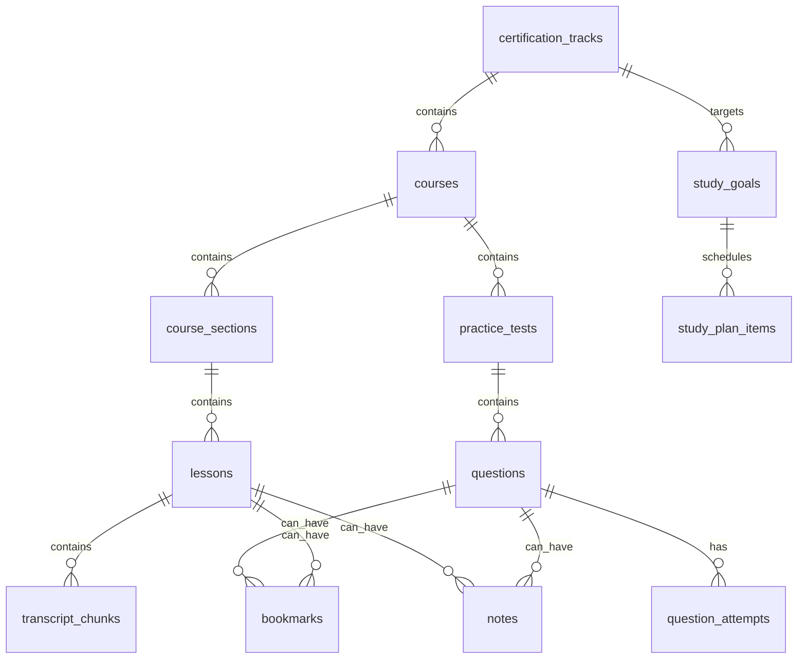

# Snowflake Brain Rebuild - Data Model

## Overview

The data model must preserve the user's source archive structure. The core rule is: do not merge content unless the student explicitly asks for a global search or mixed drill.

## Entity Relationship Summary

## Tables

### certification_tracks

Stores certification-level grouping.

Columns:

- `id` TEXT PRIMARY KEY
- `title` TEXT NOT NULL
- `description` TEXT DEFAULT ''
- `position` INTEGER DEFAULT 0

Examples:

- `snowpro-core`
- `advanced-architect`
- `advanced-data-engineer`
- `snowpark`
- `cortex-genai`

### courses

Stores each downloaded course folder.

Columns:

- `id` TEXT PRIMARY KEY
- `track_id` TEXT REFERENCES certification_tracks(id)
- `track_title` TEXT DEFAULT ''
- `title` TEXT NOT NULL
- `slug` TEXT DEFAULT ''
- `path` TEXT DEFAULT ''
- `source_url` TEXT
- `folder` TEXT DEFAULT ''
- `thumbnail` TEXT
- `section_count` INTEGER DEFAULT 0
- `lesson_count` INTEGER DEFAULT 0
- `question_count` INTEGER DEFAULT 0
- `indexed_at` TEXT

Rules:

- One row per downloaded course folder.
- Course title comes from course metadata when available.
- Track is inferred from course title and folder.

### course_sections

Stores source course sections.

Columns:

- `id` TEXT PRIMARY KEY
- `course_id` TEXT REFERENCES courses(id)
- `title` TEXT NOT NULL
- `position` INTEGER DEFAULT 0
- `lesson_count` INTEGER DEFAULT 0

Rules:

- Section names come from source video parent folder.
- Section order is inferred from source folder and video order.

### lessons

Stores video lessons.

Columns:

- `id` TEXT PRIMARY KEY
- `course_id` TEXT REFERENCES courses(id)
- `section_id` TEXT REFERENCES course_sections(id)
- `course_title` TEXT DEFAULT ''
- `section` TEXT DEFAULT ''
- `title` TEXT NOT NULL
- `position` INTEGER DEFAULT 0
- `sort_key` INTEGER DEFAULT 0
- `video_path` TEXT
- `transcript_path` TEXT
- `vtt_path` TEXT
- `info_path` TEXT
- `duration` REAL
- `duration_s` INTEGER
- `transcript_text` TEXT
- `excerpt` TEXT

Rules:

- Lesson order must follow source course order.
- `transcript_text` must be English.
- If captions are missing or non-English, use generated English notes.

### transcript_chunks

Stores lesson transcript cues or generated notes.

Columns:

- `id` INTEGER PRIMARY KEY AUTOINCREMENT
- `lesson_id` TEXT REFERENCES lessons(id)
- `chunk_idx` INTEGER NOT NULL
- `text` TEXT NOT NULL
- `start_s` REAL
- `end_s` REAL

Rules:

- English chunks only.
- Generated notes use one chunk with null start/end.

### practice_tests

Stores each downloaded practice test separately.

Columns:

- `id` TEXT PRIMARY KEY
- `course_id` TEXT REFERENCES courses(id)
- `course_title` TEXT DEFAULT ''
- `track_id` TEXT REFERENCES certification_tracks(id)
- `track_title` TEXT DEFAULT ''
- `title` TEXT NOT NULL
- `original_title` TEXT DEFAULT ''
- `position` INTEGER DEFAULT 0
- `question_count` INTEGER DEFAULT 0
- `source_path` TEXT DEFAULT ''

Rules:

- One row per source test object from `_practice-tests/practice-tests.json`.
- Generic titles like `Quiz` should become `Practice Test 1`, `Practice Test 2`, etc.
- Original title remains stored for traceability.

### questions

Stores assessment questions.

Columns:

- `id` TEXT PRIMARY KEY
- `course_id` TEXT REFERENCES courses(id)
- `course_title` TEXT DEFAULT ''
- `test_id` TEXT REFERENCES practice_tests(id)
- `test_title` TEXT DEFAULT ''
- `test_position` INTEGER DEFAULT 0
- `question_position` INTEGER DEFAULT 0
- `question` TEXT NOT NULL
- `options_json` TEXT NOT NULL DEFAULT '[]'
- `correct_json` TEXT NOT NULL DEFAULT '[]'
- `explanation` TEXT
- `source_path` TEXT
- `assessment_type` TEXT
- `tags` TEXT DEFAULT '[]'
- `difficulty` TEXT DEFAULT 'medium'
- `multiple` INTEGER DEFAULT 0

Rules:

- Questions must stay attached to their practice test.
- Full tests load by `test_id`.
- Mixed drills can query across tests only when explicitly selected.

### question_attempts

Stores submitted answers.

Columns:

- `id` INTEGER PRIMARY KEY AUTOINCREMENT
- `question_id` TEXT REFERENCES questions(id)
- `selected` TEXT NOT NULL
- `correct` INTEGER NOT NULL
- `mode` TEXT DEFAULT 'practice'
- `attempted_at` TEXT

Rules:

- Practice answer is recorded when Submit Answer is clicked.
- Exam answers are recorded when Submit Test is clicked.

### study_goals

Stores certification targets.

Columns:

- `id` INTEGER PRIMARY KEY AUTOINCREMENT
- `track_id` TEXT REFERENCES certification_tracks(id)
- `target_exam_date` TEXT
- `status` TEXT DEFAULT 'active'
- `created_at` TEXT

### study_plan_items

Stores daily tasks.

Columns:

- `id` INTEGER PRIMARY KEY AUTOINCREMENT
- `goal_id` INTEGER REFERENCES study_goals(id)
- `due_date` TEXT NOT NULL
- `item_type` TEXT NOT NULL
- `title` TEXT NOT NULL
- `course_id` TEXT
- `lesson_id` TEXT
- `practice_test_id` TEXT
- `question_count` INTEGER DEFAULT 0
- `completed` INTEGER DEFAULT 0

Item types:

- `lesson`
- `practice_test`
- `review`
- `flashcards`
- `lab`
- `mock_exam`

## Search Indexes

Existing FTS tables can remain:

- `search_fts`
- `question_fts`
- `lesson_fts`
- `chunk_fts`

Search results should include enough metadata to route back to:

- track
- course
- lesson
- practice test
- question

## Migration Strategy

Phase 1:

- Add new columns and tables without deleting old tables.
- Rebuild index from source archive.
- Populate new hierarchy.

Phase 2:

- Update frontend to use scoped APIs.
- Keep legacy endpoints temporarily.

Phase 3:

- Remove old global-only assumptions.
- Add admin override for track/course mapping if needed.

