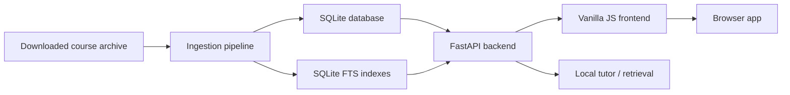
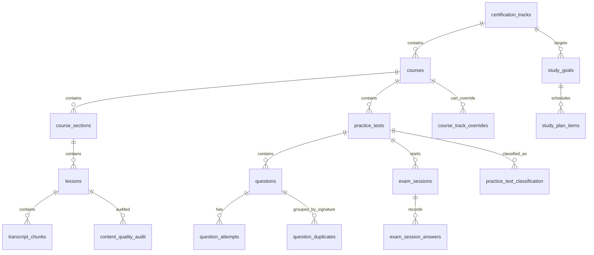

# Snowflake Brain - Data Model And Data Architecture

Last updated: 2026-06-29

## 1. Architecture Overview

Snowflake Brain uses a local-first architecture.



Core idea:

- The downloaded course archive remains local.
- The backend indexes course structure, videos, transcripts, practice tests, questions, documents, and labs.
- SQLite stores structured data and search indexes.
- FastAPI exposes scoped APIs.
- Frontend provides the student workflow.

## 2. Data Architecture Layers

### 2.1 Source Layer

Source:

- Downloaded paid course folders.
- Video files.
- Caption/transcript files.
- Metadata JSON files.
- Practice test JSON files.
- Documents/resources.

Principles:

- Preserve source course boundaries.
- Preserve source practice-test boundaries.
- Preserve source lesson order when possible.
- Never include paid course content in review zips.

### 2.2 Ingestion Layer

Responsibilities:

- Discover courses.
- Infer certification track.
- Extract course metadata.
- Extract sections and lessons.
- Extract transcripts/captions.
- Generate English study-note fallback when transcript is missing or unusable.
- Extract practice tests.
- Extract questions, answers, explanations, tags, and difficulty.
- Build search indexes.
- Seed quality/classification tables.

Risks:

- Track inference can be wrong.
- Captions can be non-English or auto-translated.
- Some "practice tests" are empty assignment shells.
- Duplicate questions exist across courses/tests.

### 2.3 Storage Layer

Primary database:

- SQLite.

Search:

- SQLite FTS tables.

Persistence:

- Local `data/snowflake_brain.sqlite`.

Important:

- SQLite is runtime data and should not be included in clean source packages.

### 2.4 API Layer

Backend:

- FastAPI.

API categories:

- Indexing/status.
- Tracks/courses/lessons.
- Practice tests/questions.
- Study plan.
- Progress/events.
- Search/retrieval.
- Flashcards.
- Labs.
- Content quality.
- Exam sessions.

### 2.5 Frontend Layer

Frontend:

- Vanilla JavaScript ES modules.

Primary workflows:

- Today.
- Lessons.
- Practice.
- Review.

Secondary routes:

- Search.
- Flashcards.
- Labs.
- AI Tutor.
- Analytics.
- Study Plan.

## 3. Core Entity Model



## 4. Existing Core Tables

### certification_tracks

Stores certification-level grouping.

Key fields:

- `id`
- `title`
- `description`
- `position`

Examples:

- `snowpro-core`
- `associate-platform`
- `advanced-architect`
- `advanced-data-engineer`
- `snowpark`
- `cortex-genai`
- `cost-optimization`
- `iceberg`
- `general-snowflake`

### courses

Stores each downloaded course.

Key fields:

- `id`
- `track_id`
- `track_title`
- `title`
- `slug`
- `path`
- `source_url`
- `folder`
- `section_count`
- `lesson_count`
- `question_count`

Rule:

One row per downloaded course source.

### course_sections

Stores source course sections.

Key fields:

- `id`
- `course_id`
- `title`
- `path`
- `position`
- `lesson_count`

Rule:

Sections preserve course order.

### lessons

Stores video lessons.

Key fields:

- `id`
- `course_id`
- `section_id`
- `course_title`
- `section`
- `title`
- `position`
- `sort_key`
- `video_path`
- `transcript_path`
- `vtt_path`
- `duration`
- `duration_s`
- `transcript_text`
- `excerpt`

Important issue:

Current data has many generated study notes and missing duration values. UI must show that clearly.

### transcript_chunks

Stores transcript cues or generated-note chunks.

Key fields:

- `id`
- `lesson_id`
- `chunk_idx`
- `text`
- `start_s`
- `end_s`

### practice_tests

Stores each source practice test separately.

Key fields:

- `id`
- `course_id`
- `course_title`
- `track_id`
- `track_title`
- `title`
- `original_title`
- `position`
- `question_count`
- `source_path`

Rule:

Do not merge tests by title. Preserve source tests.

### questions

Stores assessment questions.

Key fields:

- `id`
- `course_id`
- `course_title`
- `test_id`
- `test_title`
- `test_position`
- `question_position`
- `question`
- `options_json`
- `correct_json`
- `explanation`
- `source_path`
- `assessment_type`
- `tags`
- `difficulty`
- `multiple`

Rule:

Questions must stay attached to their source test.

### question_attempts

Stores simple per-question attempts.

Key fields:

- `id`
- `question_id`
- `selected`
- `correct`
- `mode`
- `attempted_at`

Note:

This is not enough for real exam mode. Use `exam_sessions` and `exam_session_answers` for full exams.

### study_goals

Stores certification goals.

Key fields:

- `id`
- `track_id`
- `target_exam_date`
- `weekly_hours`
- `daily_question_target`
- `status`
- `created_at`
- `updated_at`

### study_plan_items

Stores daily plan tasks.

Key fields:

- `id`
- `goal_id`
- `due_date`
- `item_type`
- `title`
- `course_id`
- `lesson_id`
- `practice_test_id`
- `question_count`
- `position`
- `completed`
- `completed_at`

Item types:

- `lesson`
- `review`
- `practice_test`
- `mock_exam`
- `lab`
- `flashcards`

## 5. Required Trust And Quality Tables

### content_quality_audit

Purpose:

Stores content trust metadata for lessons, practice tests, documents, and questions.

Fields:

- `id`
- `content_type`
- `ref_id`
- `course_id`
- `track_id`
- `quality_status`
- `reason`
- `details_json`
- `audited_at`

Example lesson statuses:

- `transcript_like`
- `generated_notes`
- `missing_transcript`
- `non_english_filtered`

Example practice-test statuses:

- `full_mock_exam`
- `practice_test`
- `micro_quiz`
- `empty_shell`

### course_track_overrides

Purpose:

Allows manual correction of inferred course-to-track mapping.

Fields:

- `course_id`
- `original_track_id`
- `override_track_id`
- `reason`
- `reviewed_by`
- `reviewed_at`

Rule:

Manual override wins over title-keyword inference.

### practice_test_classification

Purpose:

Classifies practice-test records so empty shells and assignments do not appear as full exams.

Fields:

- `test_id`
- `classification`
- `reason`
- `confidence`
- `reviewed`
- `reviewed_at`
- `created_at`
- `updated_at`

Classifications:

- `full_mock_exam`
- `practice_test`
- `section_quiz`
- `assignment`
- `lab`
- `empty_shell`
- `ignore`

### question_duplicates

Purpose:

Tracks duplicate question prompts across the archive.

Fields:

- `signature`
- `representative_question_id`
- `representative_question`
- `duplicate_count`
- `question_ids_json`
- `status`
- `reviewed_at`
- `created_at`
- `updated_at`

Statuses:

- `unreviewed`
- `accepted_duplicate`
- `merge_candidate`
- `ignored`

## 6. Exam Session Model

### exam_sessions

Purpose:

Represents one practice or exam run.

Fields:

- `id`
- `track_id`
- `course_id`
- `practice_test_id`
- `mode`
- `started_at`
- `finished_at`
- `score`
- `total_questions`
- `status`

Modes:

- `practice`
- `exam`
- `drill`

Statuses:

- `in_progress`
- `finished`
- `abandoned`

### exam_session_answers

Purpose:

Stores answers inside an exam session.

Fields:

- `id`
- `session_id`
- `question_id`
- `selected_json`
- `correct`
- `answered_at`
- `reviewed`

Rule:

Exam mode should grade only after session finish.

Practice mode may grade immediately.

## 7. Learning Events Model

### learning_events

Purpose:

Provides an event stream for progress and readiness.

Fields:

- `id`
- `event_type`
- `track_id`
- `course_id`
- `lesson_id`
- `practice_test_id`
- `question_id`
- `lab_id`
- `flashcard_id`
- `study_plan_item_id`
- `metadata_json`
- `created_at`

Events:

- `lesson_completed`
- `quiz_question_answered`
- `practice_test_finished`
- `flashcard_reviewed`
- `lab_submitted`
- `weak_topic_repaired`
- `exam_session_started`

Why this matters:

Readiness should be based on real study activity, not only manually clicking Done.

## 8. Topic Objective Model

### topic_objectives

Purpose:

Maps exam domains/objectives to tracks and later to questions/lessons.

Fields:

- `id`
- `track_id`
- `domain`
- `objective`
- `weight`
- `source`
- `created_at`

Future link tables:

- `lesson_objectives`
- `question_objectives`
- `lab_objectives`

## 9. Search And Local Tutor Architecture

### Current Search

Existing FTS tables:

- `search_fts`
- `question_fts`
- `lesson_fts`
- `chunk_fts`

### Required Tutor Retrieval

The tutor should retrieve from:

- current question
- answer options
- downloaded explanation
- source test
- selected lesson
- transcript chunks
- course documents
- related questions

Input context:

- `track_id`
- `course_id`
- `lesson_id`
- `practice_test_id`
- `question_id`
- `selected_answer`
- `correct_answer`

Output:

- Answer.
- Why correct.
- Why other options are wrong.
- Exam trap.
- Sources.

## 10. Readiness Calculation Architecture

Readiness should combine:

- Lesson completion.
- Question coverage.
- Practice accuracy.
- Full mock exam score.
- Recency of practice.
- Weak-topic repair.
- Flashcard completion.
- Content quality confidence.

Do not overstate readiness when:

- The track has too few questions.
- No full mock exams exist.
- Lessons are mostly generated notes.
- Course mapping is unreviewed.

## 11. Packaging Architecture

Clean review package includes:

- `app/`
- `frontend/`
- `docs/`
- `requirements.txt`
- `Dockerfile`
- `docker-compose.yml`
- `README.md`
- `REVIEW_PACKAGE.md`
- `.gitignore`
- `.dockerignore`

Clean review package excludes:

- `.git/`
- `.venv/`
- `data/`
- `*.sqlite`
- `static/`
- `review_artifacts/`
- `dist/`
- `__pycache__/`
- `.DS_Store`
- `__MACOSX/`
- downloaded paid course content

## 12. Environment Configuration

Required environment variables:

- `CONTENT_ROOT_HOST`: host path to downloaded course archive.
- `ANTHROPIC_API_KEY`: optional external AI key.

Docker volume rule:

```yaml
volumes:
  - "${CONTENT_ROOT_HOST:-./content}:/content:ro"
  - "./data:/data"
```

This avoids hardcoded user-specific Mac paths.

