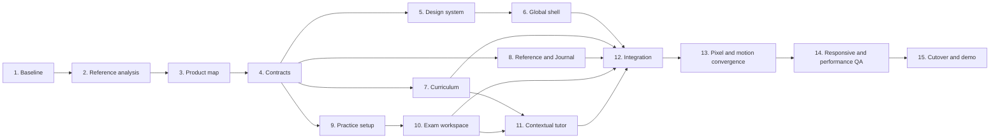

# Exact Replica: Step-By-Step Implementation Plan

Last updated: 2026-07-31

## Goal

Rebuild the existing Snowflake Certification Prep application so its layout, visual hierarchy, workflow, component states, responsive behavior, and animations faithfully match the website shown in:

`/Users/297159/Desktop/Screen Recording 2026-07-31 at 11.26.33 AM.mov`

The application will retain its own name, Snowflake/Data + AI content, questions, videos, transcripts, and user data. Reference branding, logos, proprietary writing, and proprietary questions will not be copied.

## Approval Rule

No production implementation begins until this plan and the reference-analysis deliverables in Step 2 are approved.

## Step 1: Freeze And Baseline The Existing Product

Tasks:

1. Record the active branch, commit, and dirty worktree files.
2. Back up the SQLite database and configuration.
3. Inventory routes, frontend modules, APIs, tables, and Docker services.
4. Capture every current route at desktop, tablet, and mobile sizes.
5. Measure route load times, API latency, console errors, DOM size, and asset sizes.
6. Verify current lesson, course, practice-test, and question counts from SQLite.

Deliverables:

- Baseline report
- Route inventory
- Data-count report
- Current screenshots
- Performance baseline

Exit gate:

- Existing data is backed up.
- Current behavior is reproducible.
- No production file has been changed.

## Step 2: Reverse Engineer The Reference Recording

Tasks:

1. Inspect the source video resolution, frame rate, and duration.
2. Extract frames at every route, scroll position, menu, hover, selection, and transition.
3. Remove browser chrome from measurements.
4. Measure header height, content rails, gutters, columns, card bounds, controls, and vertical rhythm.
5. Sample background, surface, border, text, accent, success, warning, and domain colors.
6. Identify typography roles, approximate font metrics, line heights, and readable widths.
7. Record all visible component states.
8. Measure each animation from first changed frame to settled frame.
9. Document fixed, sticky, and independently scrolling regions.
10. Produce a route-by-route reference specification.

Deliverables:

- Reference screen inventory
- Timestamped frame library
- Layout measurement sheet
- Visual token sheet
- Motion storyboard
- Responsive behavior notes

Exit gate:

- Every target screen has a clean reference frame.
- Every measurable dimension has a recorded value.
- Every visible animation has a measured duration and state sequence.
- No implementation value needs to be guessed where the recording provides evidence.

## Step 3: Confirm The Target Product Map

Tasks:

1. Map the reference pages to this application's data and routes.
2. Confirm the four primary destinations: Curriculum, Practice, Reference, and Journal.
3. Move AI Tutor, Search, Notes, Bookmarks, Progress, and certification selection into contextual controls.
4. Map old routes to new routes or redirects.
5. Decide which current features are retained contextually, archived, or removed from navigation.
6. Confirm desktop, tablet, and mobile route behavior.

Deliverables:

- Old route to new route matrix
- Final navigation map
- Page responsibility matrix
- Approved learner journey

Exit gate:

- Every current route has an explicit destination.
- No feature appears as an unexplained parallel product.
- The selected certification scopes every learning page.

## Step 4: Define Frontend And API Contracts

Tasks:

1. Define paginated API responses for certifications, courses, sections, lessons, tests, questions, references, journal entries, attempts, and progress.
2. Define loading, empty, error, and unavailable-data states.
3. Define Practice Mode and Exam Mode state machines.
4. Define local tutor request, retrieval scope, answer, citation, and confidence contracts.
5. Define browser persistence for active attempts and selected certification.
6. Define canonical deduplication rules without deleting source files.

Deliverables:

- API contract document
- Frontend state model
- Practice and exam state diagrams
- Deduplication rules
- Persistence rules

Exit gate:

- Frontend agents can work without inventing API behavior.
- Answer keys cannot leak before exam submission.
- Source course and practice-test boundaries remain intact.

## Step 5: Create The Replica Design System

Tasks:

1. Convert measured colors, spacing, type roles, borders, radii, and shadows into CSS tokens.
2. Implement the reference-matched reset and body treatment.
3. Implement global content rails and breakpoints.
4. Implement controls and every required state.
5. Implement measured motion tokens.
6. Implement skeletons matching final geometry.
7. Implement reduced-motion behavior.

Deliverables:

- Scoped replica token stylesheet
- Shell stylesheet
- Motion stylesheet
- State and accessibility specimen page

Exit gate:

- Token specimen matches the reference visual relationships.
- Controls do not cause layout shift between states.
- Keyboard focus and reduced motion work.

## Step 6: Build The Exact Global Shell

Tasks:

1. Replace the permanent dashboard sidebar with the reference compact top navigation.
2. Implement brand placement, primary links, account/progress controls, and primary action.
3. Implement the matching footer.
4. Implement route transitions and scroll restoration.
5. Implement responsive navigation behavior.
6. Add legacy route redirects without showing the old shell.

Deliverables:

- Replica header and footer
- Responsive navigation
- Route aliases
- Desktop and mobile overlays

Exit gate:

- Header, footer, rail, and spacing geometry match the reference.
- Exactly four primary destinations are visible.
- No old dashboard shell remains on target routes.

## Step 7: Build Curriculum And Lesson Entry

Tasks:

1. Recreate the reference curriculum composition.
2. Group content by selected certification, course, section, and lesson.
3. Keep the page text-first with thin dividers and restrained disclosures.
4. Load sections and lessons only when needed.
5. Connect existing videos, transcripts, notes, and progress.
6. Add contextual lesson actions without changing the reference composition.
7. Ensure English-only display and correct source labels.

Deliverables:

- Curriculum route
- Course/section disclosures
- Lesson entry flow
- Loading, empty, and error states

Exit gate:

- One certification never displays another certification's courses.
- No duplicate lesson is visible.
- Layout and disclosure motion match the reference.
- Route entry does not load the whole archive.

## Step 8: Build Reference And Journal

Tasks:

1. Recreate the reference resource directory.
2. Group official, owned-course, generated, and external sources clearly.
3. Recreate the compact editorial journal grid.
4. Recreate the narrow article reading layout.
5. Connect only real sources and complete articles.
6. Implement measured hover and route-entry animations.

Deliverables:

- Reference route
- Journal route
- Article route
- Source-type labels

Exit gate:

- Every item opens real content.
- No filler cards or fabricated metadata appear.
- Layout overlays match the corresponding reference screens.

## Step 9: Build Practice-Test Setup

Tasks:

1. Recreate the centered Mock Exam introduction.
2. Show verified question count, expected duration, mode, domains, and passing rule.
3. Keep each source Practice Test 1, Practice Test 2, and later test separate.
4. Add Practice Mode and Exam Mode selection.
5. Add full-source-test and custom-domain options.
6. Match all setup controls, spacing, and entry animations.

Deliverables:

- Practice library
- Test setup route
- Mode and domain controls
- Start/resume behavior

Exit gate:

- Test counts are verified and source-faithful.
- No unrelated question banks are silently merged.
- Setup screen geometry matches the reference.

## Step 10: Build The Immersive Exam Workspace

Tasks:

1. Switch from the editorial shell to the reference exam workspace after start.
2. Implement the left exam navigator and domain legend.
3. Implement the center scenario, question, and answer area.
4. Implement timer and status only in Exam Mode.
5. Implement answered, unanswered, selected, flagged, and current states.
6. Implement previous, next, flag, submit, and confirmation behavior.
7. Persist state across navigation and refresh.
8. Defer scoring and explanations until Exam Mode submission.
9. Render 100+ question sessions without lag.
10. Recreate the recorded state transitions and animations.

Deliverables:

- Practice workspace
- Exam workspace
- Question navigator
- Persistence and scoring
- Results route

Exit gate:

- Practice Mode has no timer and has explicit Check Answer.
- Exam Mode has a timer and deferred explanations.
- Refresh resumes the correct state.
- Scoring is deterministic.
- Visual and motion comparisons match the recording.

## Step 11: Add The Contextual Local Tutor

Tasks:

1. Add tutor access inside lessons, checked practice questions, results, and references.
2. Scope retrieval to the selected certification and current context.
3. Return concise English answers with clickable citations.
4. Provide extractive local answers without an external API key.
5. Add hints before Practice Mode checking without revealing the answer.
6. Block answer assistance during active Exam Mode.
7. Remove the disconnected top-level AI chat page from primary navigation.

Deliverables:

- Shared contextual tutor component
- Local retrieval endpoint
- Citation UI
- No-key tests

Exit gate:

- The tutor answers from owned course context without an API key.
- Citations open the relevant lesson, transcript timestamp, question, or source.
- Exam integrity rules pass.

## Step 12: Integrate Without Regressing Data

Tasks:

1. Merge backend contracts first.
2. Merge design tokens and shell second.
3. Merge editorial routes third.
4. Merge practice and exam fourth.
5. Merge the contextual tutor fifth.
6. Register routes and imports centrally.
7. Run non-destructive migrations.
8. Rebuild Docker.
9. Verify existing database records and progress.

Deliverables:

- Integrated application
- Migration report
- Route smoke results
- Data-integrity report

Exit gate:

- No user data is lost.
- No duplicate navigation or global CSS conflict exists.
- All target routes load from the Docker application.

## Step 13: Pixel And Motion Convergence

For every target screen:

1. Capture the implementation at the exact reference viewport.
2. Generate a 50% opacity overlay.
3. Generate an absolute pixel-difference image.
4. Classify geometry, typography, color, state, and content-flow mismatches.
5. Record the same interaction at 60 fps.
6. Compare state order, start/end frame, duration, easing character, and layout shift.
7. Fix the responsible component.
8. Repeat until no major mismatch remains.

Deliverables:

- Reference/implementation pairs
- Overlay images
- Difference images
- Motion comparison recordings
- Mismatch log

Exit gate:

- No major mismatch in header, rails, columns, control placement, or typography hierarchy.
- No unexplained motion mismatch.
- Remaining visible differences are limited to product branding and owned content.

## Step 14: Responsive, Accessibility, And Performance QA

Viewports:

- `390x844`
- `768x1024`
- `1440x900`
- Exact desktop reference aspect ratio

Tasks:

1. Run all primary learner journeys at every viewport.
2. Test keyboard-only operation.
3. Test visible focus, contrast, semantics, and reduced motion.
4. Test slow network, empty state, API error, and unavailable media.
5. Measure route transition time, API latency, DOM size, and memory.
6. Verify 100+ question performance.
7. Check console and server logs.

Exit gate:

- No horizontal overflow, overlap, clipped text, or inaccessible control.
- No blank full-page loading state.
- Routes feel immediate after shell load.
- Required workflows pass without console or server errors.

## Step 15: Controlled Cutover And Demo

Tasks:

1. Keep legacy routes as redirects for one release.
2. Create a final backup and rollback note.
3. Rebuild and restart Docker.
4. Open the final browser URL.
5. Demonstrate Curriculum, lesson, Practice Mode, Exam Mode, results, Reference, Journal, and contextual tutor.
6. Provide the final changed-file, test, performance, and known-limitations report.

Exit gate:

- The live browser demonstrates the complete replica workflow.
- Rollback is documented.
- The final visual QA report is approved.

## Work Order And Dependencies

## Implementation Order Summary

1. Preserve and measure the current application.
2. Reverse engineer the recording before writing UI code.
3. Approve the route and workflow map.
4. Freeze frontend/API contracts.
5. Build measured tokens and motion.
6. Build the exact shell.
7. Build Curriculum.
8. Build Reference and Journal.
9. Build Practice Setup.
10. Build the immersive Exam Workspace.
11. Add contextual local AI.
12. Integrate in a controlled order.
13. Iterate using pixel and motion differences.
14. Complete responsive, accessibility, and performance QA.
15. Cut over and demonstrate in the live browser.

