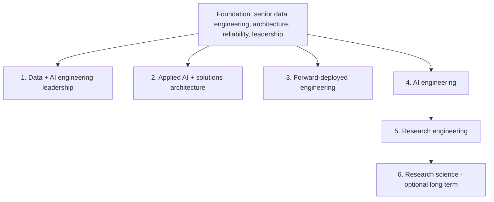

# Role Strategy

The anchor is **Anthropic Data Engineering Manager, Product**. The wider curriculum preserves optionality without treating every lane as equal priority.

## Lane Comparison

| Lane | Example titles | Technical depth | Leadership depth | Priority |
|---|---|---:|---:|---|
| Data + AI engineering leadership | Data Engineering Manager, Product; Director Data/AI Platforms; Principal Data/AI Architect | 4-5 | 5 | **1 - anchor** |
| Applied AI + solutions architecture | Applied AI Architect; Solutions Architect; Principal AI Architect | 4 | 4-5 | **2** |
| Forward-deployed engineering | FDE Lead; AI Deployment Lead; Customer AI Engineer | 4 | 4 | **2** |
| AI engineering | Senior/Staff AI Engineer; AI Platform Engineer | 4 | 3-4 | **3** |
| Research engineering | Research Engineer; ML Systems Engineer | 4 in systems, 3-4 in research | 2-3 | **4** |
| Research science | Research Scientist | 5 in a research specialty | 2-3 | **Optional** |

## 1. Data And AI Engineering Leadership

- **Responsibilities:** product-event contracts, canonical data products, AI telemetry, platform roadmaps, quality/SLA governance, self-service analytics, hiring, partner alignment and incident accountability.
- **Transferable strengths:** large-scale pipelines, distributed systems, dimensional modeling, SQL/Python, data contracts, cost control, stakeholder negotiation and team leadership.
- **Main gaps:** AI-product telemetry, LLM evaluation systems, model/tool traces, governed natural-language analytics and modern AI risk controls.
- **Evidence:** Product Data and Intelligence Platform; team charter; metric council; reliability scorecard; executive roadmap; eight leadership stories.
- **Interview emphasis:** product metrics, data-system design, operating model, hiring, cross-functional influence and failure recovery.

## 2. Applied AI And Solutions Architecture

- **Responsibilities:** discover use cases, design model/RAG/agent solutions, define security boundaries, run prototypes, establish evaluation gates and guide production adoption.
- **Transferable strengths:** requirements decomposition, enterprise integration, cloud architecture, governance and architecture defense.
- **Main gaps:** model behavior, context engineering, tool design, provider trade-offs, eval design and AI-specific threat modeling.
- **Evidence:** Governed Enterprise Agent Platform plus an architecture workshop and decision log.
- **Interview emphasis:** build-vs-buy, latency/quality/cost trade-offs, enterprise identity, rollout and customer outcomes.

## 3. Forward-Deployed Engineering

- **Responsibilities:** embed with customers, turn ambiguous goals into working systems, integrate data and identity, instrument outcomes and convert one-off delivery into reusable product capability.
- **Transferable strengths:** production troubleshooting, stakeholder trust, architecture under constraints and delivery ownership.
- **Main gaps:** rapid AI prototyping, discovery facilitation, value hypotheses, evaluation under incomplete requirements and adoption design.
- **Evidence:** Forward-Deployed AI Transformation Case Study with discovery record, prototype, security review, cost model and executive readout.
- **Interview emphasis:** ambiguity, customer conflict, time-boxed delivery, measurable adoption and product feedback.

## 4. AI Engineering

- **Responsibilities:** implement LLM applications, retrieval, tools/agents, APIs, evaluation, observability, deployment and incident response.
- **Transferable strengths:** software/data pipelines, service operations, testing, APIs and cloud systems.
- **Main gaps:** PyTorch literacy, embeddings/reranking, prompt/context design, agent control loops and model serving.
- **Evidence:** production-quality services with tests, traces, eval datasets, SLOs and runbooks.
- **Interview emphasis:** Python/TypeScript, system design, debugging, RAG quality, security and cost.

## 5. Research Engineering

- **Responsibilities:** implement papers, build datasets/training loops, optimize GPU workloads, run controlled experiments and communicate findings.
- **Transferable strengths:** reproducible pipelines, performance engineering, data quality and operational rigor.
- **Main gaps:** mathematical depth, transformer internals, distributed training, ablations and research writing.
- **Evidence:** Language Model Research Laboratory with tokenizer, small transformer, fine-tuning, profiling and paper reproduction.
- **Interview emphasis:** PyTorch, tensor shapes, optimization, experiment design, systems bottlenecks and paper discussion.

## 6. Research Science - Longer-Term Optional Path

- **Responsibilities:** formulate novel hypotheses, design original research, produce externally credible results and advance a specialty.
- **Gap reality:** courses establish literacy, not research-scientist readiness. Readiness normally requires sustained original evidence, strong mathematics, publications or equivalent research impact.
- **Evidence:** multiple high-quality reproductions, novel ablations, open-source contributions and eventually original research.
- **Recommended priority:** defer until production AI and research-engineering evidence are strong.

## Positioning Rule

Lead with proven senior outcomes: reliable product-data platforms, teams, governance and cross-functional delivery. Use AI work to demonstrate expansion of scope, not to obscure 14+ years of accumulated leverage.
