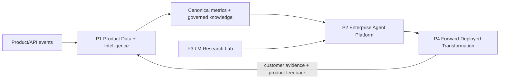

# Connected Portfolio Projects

The four projects form one evidence system rather than isolated demos.



## P1 - AI Product Data And Intelligence Platform

- **Scenario:** a multi-surface AI company needs trusted product, model and cost telemetry for Product, Data Science, Finance and Engineering.
- **Architecture:** event SDK/contracts -> stream/batch ingestion -> raw/clean layers -> dbt canonical facts/dimensions -> semantic metrics -> dashboards and governed analytics copilot.
- **Stack:** Python, Kafka/Redpanda optional, DuckDB/Postgres, Airflow, dbt Core, Great Expectations, OpenLineage, Superset/Metabase and an LLM adapter.
- **Scope:** consumer/coding/enterprise/API events; model/token/latency/cost/tool-use traces; identity/privacy tiers; freshness SLAs.
- **Milestones:** event taxonomy; replayable ingestion; canonical models; tests/lineage; metrics; copilot; SLO dashboard.
- **Metrics:** duplicate/drop rate, freshness, test pass rate, metric reconciliation, query adoption, grounded-answer rate, cost per active account.
- **Evaluation/security:** contract and reconciliation tests; retrieval eval; row/column access; PII minimization; retention; audit log.
- **Leadership artifacts:** charter, metric-council terms, roadmap, RACI, hiring plan, architecture review and incident postmortem.
- **Interview stories:** resolving metric conflict; balancing speed/quality; influencing Product; operating through a data incident.
- **Definition of done:** a new product surface can onboard through documented contracts; trusted metrics and copilot answers are measurable and owned.

Suggested repository:

```text
p1-product-intelligence/
  contracts/ ingestion/ dbt/ quality/ semantic/ copilot/ dashboards/
  docs/adr/ docs/leadership/ tests/ runbooks/
```

## P2 - Governed Enterprise Agent Platform

- **Scenario:** business teams need reusable AI agents over enterprise data without unmanaged provider access or excessive tool authority.
- **Architecture:** API gateway -> policy/model router -> context/RAG -> agent runtime -> MCP/tool registry -> approval service -> providers; traces/evals feed P1.
- **Stack:** FastAPI/TypeScript, provider SDKs, Postgres/pgvector, OpenSearch optional, MCP SDK, OPA, OpenTelemetry, MLflow and Kubernetes.
- **Milestones:** gateway; auth/RBAC; retrieval; MCP tools; HITL; eval service; security controls; canary/rollback.
- **Metrics:** task success, groundedness, unsafe-action block rate, p95 latency, availability, token/cost per task and approval rate.
- **Evaluation/security:** golden sets, adversarial suites, human review; injection isolation, least privilege, egress policy, secret handling, replay protection and immutable audit.
- **Leadership artifacts:** platform principles, service tiers, risk register, provider strategy, SLOs, incident runbook and adoption plan.
- **Interview stories:** build-vs-buy; gateway trade-offs; preventing a risky launch; turning one integration into a platform.
- **Definition of done:** two applications reuse the gateway/tool registry and must pass quality, safety, latency and cost gates before release.

## P3 - Language Model Research Laboratory

- **Scenario:** an internal lab needs reproducible small-model experiments that teach model internals without pretending to train frontier models.
- **Architecture:** versioned corpus -> tokenizer -> transformer/training loop -> checkpoints -> SFT/LoRA/quantization -> eval/profile store.
- **Stack:** Python, PyTorch, Hugging Face tokenizers/PEFT, MLflow, pytest and optional local GPU/low-cost free notebook runtime.
- **Milestones:** tokenizer; small transformer; pre-training; SFT; LoRA; quantization; evaluation; profiling; paper reproduction and ablations.
- **Metrics:** loss/perplexity where appropriate, downstream quality, tokens/sec, memory, checkpoint recovery and reproducibility variance.
- **Security:** dataset provenance/license, secret scanning, dependency pinning and artifact checksums.
- **Leadership artifacts:** experiment charter, compute budget, research review, reproducibility checklist and limitations memo.
- **Interview stories:** failed hypothesis, profiler-driven improvement, data-quality discovery and method limitation.
- **Definition of done:** another engineer reproduces the main result and two ablations from a clean environment.

## P4 - Forward-Deployed AI Transformation Case Study

- **Scenario:** a regulated enterprise wants an AI workflow but lacks a validated use case, clean integration path and risk ownership.
- **Architecture:** current-state systems -> governed integration/MCP layer -> P2 platform -> workflow UI -> P1 telemetry and business outcomes.
- **Stack:** reuse P1/P2; add diagrams, workshop assets, prototype UI and optional n8n for one time-boxed workflow.
- **Milestones:** discovery; stakeholder map; current state; value hypothesis; prototype; eval plan; security review; target architecture; cost model; roadmap; adoption plan.
- **Metrics:** cycle time, task success, adoption, escalation rate, risk findings, unit economics and time to onboard another use case.
- **Evaluation/security:** customer acceptance set, red-team tests, human approval thresholds, data-flow/threat model and rollback.
- **Leadership artifacts:** executive deck, technical workshop, decision log, steering cadence, change plan and product feedback memo.
- **Interview stories:** ambiguous scope, skeptical security partner, failed prototype, adoption barrier and reusable product insight.
- **Definition of done:** executive sponsor can approve/decline from evidence; engineering can estimate and stage production delivery; reusable components are identified.

## Repository Structures

| Project | Recommended top-level modules |
|---|---|
| P1 | `contracts/ ingestion/ dbt/ quality/ semantic/ copilot/ dashboards/ tests/ runbooks/ docs/adr/ docs/leadership/` |
| P2 | `gateway/ authz/ rag/ agents/ mcp/ approvals/ evals/ telemetry/ deploy/ tests/security/ runbooks/ docs/adr/` |
| P3 | `data/ tokenizer/ model/ training/ adaptation/ inference/ evals/ profiles/ reproductions/ tests/ reports/` |
| P4 | `discovery/ current-state/ prototype/ evaluations/ security/ target-architecture/ cost-model/ roadmap/ workshops/ executive/ product-feedback/` |

Every repository includes a reproducible local setup, pinned dependencies, CI, data/provenance notes, license/security checks, an evidence index and a limitations section.
