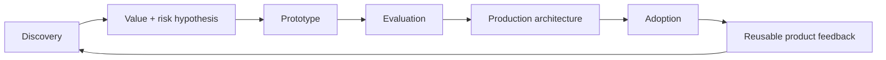

# Forward-Deployed And Solutions Architecture

## Delivery Loop

## Competencies

| Competency | Senior expectation | Evidence |
|---|---|---|
| Customer discovery | Expose decision, workflow, users, pain, constraints and success measure | Interview guide and synthesized findings |
| Goal-to-architecture translation | Connect business outcome to data/model/tool/control design | Traceable requirement/architecture matrix |
| Technical pre-sales | Demonstrate value without hiding risk or implementation effort | Time-boxed prototype and decision memo |
| Prototype-to-production | Define hardening, ownership, SLOs, migration and rollback | Production gap assessment |
| Enterprise integration | Identity, network, data, APIs, MCP and change boundaries | Integration architecture and sequence |
| Security/governance | Threat model, least privilege, approvals, audit and retention | Security review package |
| Workshops | Facilitate decisions across executives and engineers | Agenda, exercises and decisions log |
| ROI/adoption | Baseline, unit economics, behavior change and leading indicators | Benefits model and adoption dashboard |
| Product feedback | Separate reusable capability from customer-specific code | Product feedback memo and component backlog |
| Embedded delivery | Operate with travel, incomplete context and customer urgency | Engagement plan and escalation model |

## Role Mapping

| Role | Distinguishing emphasis |
|---|---|
| Anthropic Applied AI Architect | Claude application architecture, evaluations, safety and high-trust advisory work |
| Anthropic Solutions Architect | Enterprise integration, technical strategy, adoption and reusable patterns |
| OpenAI forward-deployed roles | Rapid end-to-end deployment, product feedback and measurable customer outcomes |
| Cursor Solutions Architect | Developer workflow, security, enterprise rollout and coding-agent value |
| Cursor Forward-Deployed Engineer | Embedded implementation, integrations, debugging and productization |

## Practice Sequence

1. Conduct five simulated discovery interviews with conflicting stakeholders.
2. Produce a one-page value/risk hypothesis before prototyping.
3. Build only the riskiest vertical slice.
4. Define acceptance/evaluation tests with the customer, including failure and abuse cases.
5. Present target architecture, cost, SLOs, security and phased rollout.
6. Run a technical workshop and executive readout.
7. Extract reusable adapters, policies, evals and deployment templates.

## Interview Evidence

Prepare examples of ambiguous goals, difficult integrations, a prototype that disproved an assumption, a security constraint that changed design, adoption resistance and a one-off request converted into platform capability.
