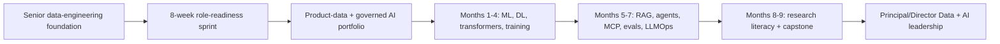

# Data + AI Career Curriculum

Last verified: **2026-07-14**

## Executive Positioning

This curriculum is designed for a professional with **14+ years of data-engineering experience**. It is an expansion of an established senior career, not a restart. The target position is:

> Principal/Director-level Data and AI Platform Leader with deep data-engineering experience, production AI engineering capability, AI research literacy, product-data leadership, and forward-deployed/customer-facing architecture skills.

The anchor role is **Anthropic Data Engineering Manager, Product**. Adjacent lanes include Applied AI Architect, Solutions Architect, forward-deployed engineering leadership, AI platform leadership, AI Engineer, and a staged Research Engineer path.

## T-Shaped Strategy

- **Expert depth (levels 4-5):** data engineering, product data, data/AI platforms, organizational leadership, evaluations, reliability, security and governance.
- **Production depth (level 4):** LLM applications, RAG, agents, MCP, context/token engineering, LLMOps and forward-deployed delivery.
- **Working literacy (levels 2-3):** model training, multimodal AI, reinforcement learning, interpretability and research methods.

Do not attempt equal mastery across every AI specialty. The differentiator is the ability to connect trustworthy product data, AI systems, organizational execution and customer outcomes.

## Operating Cadence

- Default commitment: **12 hours per week**.
- First **8 weeks:** application readiness and visible portfolio evidence.
- Following **9 months / 36 weeks:** deeper AI engineering and research literacy.
- Every topic must produce an observable artifact: code, test, benchmark, architecture decision, design review, incident exercise, paper note, presentation or interview story.
- Portfolio evidence and leadership outcomes matter more than certificates.

## Curriculum Index

1. [Role strategy](01-role-strategy.md)
2. [Skill matrix](02-skill-matrix.md)
3. [Eight-week role-readiness sprint](03-eight-week-role-readiness-sprint.md)
4. [Nine-month AI mastery roadmap](04-nine-month-ai-mastery-roadmap.md)
5. [Weekly study plan](05-weekly-study-plan.md)
6. [Free learning resources](06-free-learning-resources.md)
7. [Portfolio projects](07-portfolio-projects.md)
8. [Anthropic role alignment](08-anthropic-role-alignment.md)
9. [Forward-deployed and solutions architecture](09-forward-deployed-and-solutions-architecture.md)
10. [AI Engineer track](10-ai-engineer-track.md)
11. [Research Engineer track](11-research-engineer-track.md)
12. [Leadership and management](12-leadership-and-management.md)
13. [Interview preparation](13-interview-preparation.md)
14. [Research-paper roadmap](14-research-paper-roadmap.md)
15. [36-week progress tracker](15-progress-tracker.md)
16. [Skill assessment CSV](skill-assessment.csv)
17. [Machine-readable curriculum](curriculum.yaml)
18. [Machine-readable resources](resources.yaml)

## How To Use The Trackers

1. Open `skill-assessment.csv`, enter a current level only where evidence exists, and assign a next action. Re-score monthly.
2. Use `15-progress-tracker.md` weekly. A checkbox is earned by a linked artifact, not by watching content.
3. Use monthly gates in `curriculum.yaml` as release criteria. A failed gate changes the next month's scope.
4. Keep an evidence index in each portfolio repository linking decisions, tests, traces, dashboards, presentations and retrospectives.
5. Use `resources.yaml` as the approved resource catalog. Udemy Premium searches are optional supplements; official docs remain the source of truth.

## First Decision

Run the evidence inventory in Week 1 before adding new study. The fastest path is to reframe existing leadership, reliability, architecture and product-data outcomes in AI-platform terms, then close only the gaps that block credible execution.
